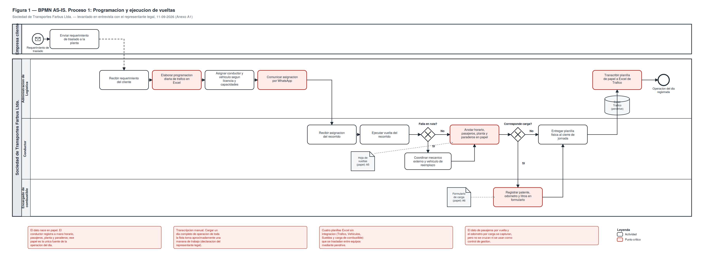
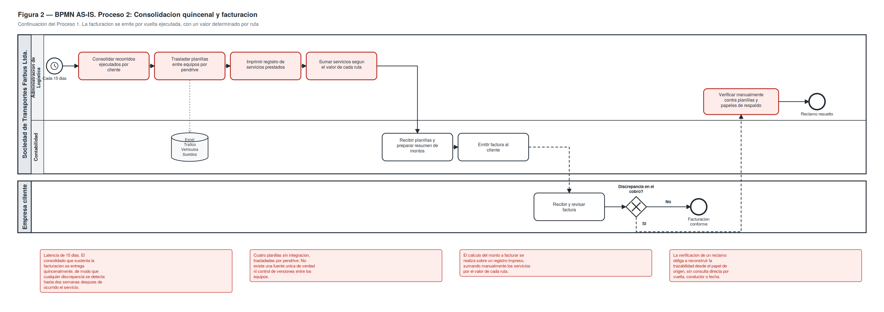
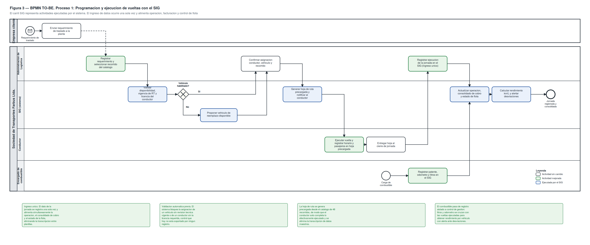
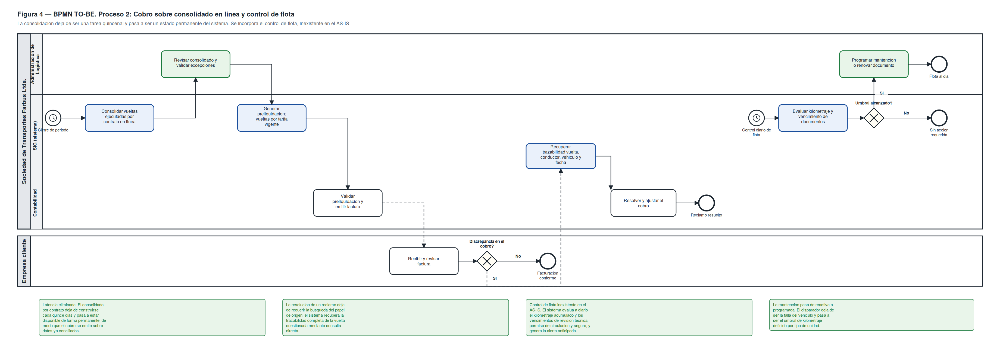

# 02 — Procesos BPMN

Se modelan dos procesos que juntos forman el ciclo crítico de Farbus: la programación y
ejecución de las vueltas, y la consolidación que sustenta el cobro. Se separaron porque
funcionan en ciclos distintos —diario el primero, quincenal el segundo— y porque la pauta
pide que los diagramas sean legibles.

## AS-IS

*Figura 1 — Programación y ejecución de vueltas.*

*Figura 2 — Consolidación quincenal y facturación.*

El cliente envía el requerimiento a la planta. Los administradores de logística arman la
programación en Excel y asignan conductor y vehículo según licencia, capacidades y
requerimientos del recorrido; avisan por WhatsApp. El conductor hace unas 6 vueltas por
jornada y anota en papel horario, pasajeros, planta, paraderos y sentido. Si el vehículo
falla se coordina al mecánico externo y una unidad de reemplazo; si corresponde carga, el
encargado anota patente, odómetro y litros en otro formulario. Al cierre entrega la planilla
física, que los administradores transcriben al Excel de Tráfico, lo que toma cerca de una
mañana para toda la flota. Cada quince días se consolida, se imprime el registro por empresa
y se suma según el valor de cada ruta; contabilidad prepara el resumen y emite la factura.

### Puntos críticos

| # | Punto crítico | Dimensión |
|---|---|---|
| 1 | El dato nace en papel y es la única fuente de la operación del día | P1 |
| 2 | Transcripción manual de aproximadamente 4 horas diarias | P1 |
| 3 | Cuatro planillas sin integración, trasladadas por pendrive | P5 |
| 4 | Pasajeros y odómetro se capturan, pero no se cruzan ni se usan | P3 |
| 5 | Latencia de quince días hasta el consolidado de cobro | P2 |
| 6 | El monto se calcula sumando manualmente sobre un registro impreso | P1, P2 |
| 7 | La verificación de un reclamo exige volver al papel de origen | P2 |
| 8 | No existe ninguna actividad de control documental ni de mantención programada | P4 |

Sobre el punto 8: la empresa declara controlar los vencimientos de revisión técnica, pero en
el listado de flota entregado como evidencia esas cinco columnas están completamente en
blanco. El control existe como práctica declarada, no como actividad respaldada por un
registro, y por eso no se modeló en el AS-IS.

## TO-BE

*Figura 3 — Operación con el SIG. El carril «SIG» son actividades que ejecuta el sistema.*

*Figura 4 — Cobro sobre consolidado en línea y control de flota.*

### Qué se automatiza

| Automatización | Efecto |
|---|---|
| Validación previa a la asignación | La verificación de vehículo operativo, revisión técnica y licencia deja de depender de la memoria del administrador |
| Generación de la hoja de ruta | Se emite precargada desde el catálogo, eliminando la reescritura de datos maestros |
| Consolidación por contrato | Deja de ser tarea quincenal y pasa a ser un estado permanente del sistema |
| Cálculo del rendimiento | El cruce litros–odómetro–vueltas se ejecuta solo, con alerta por desviación |
| Aviso de mantención y vencimientos | Evaluación diaria de kilometraje y fechas, con alerta anticipada |

### Qué se controla

| Control | AS-IS | TO-BE |
|---|---|---|
| Habilitación del vehículo asignado | Sin verificación sistemática | Bloqueo automático antes de asignar |
| Coherencia entre vueltas cobradas y ejecutadas | Suma manual sobre impreso | Preliquidación desde el consolidado |
| Vigencia documental de la flota | Declarada, sin registro | Registro por documento con alerta |
| Consumo anómalo de combustible | Detectable, no monitoreado | Alerta por desviación del rango histórico |
| Trazabilidad ante reclamo | Reconstrucción manual desde papel | Consulta directa por vuelta o fecha |

### Qué se mide

| KPI | Línea base AS-IS | Meta TO-BE |
|---|---|---|
| Horas-hombre de digitación por día | ≈4 h (estimado) | ≤1 h |
| Latencia del consolidado | 15 días | 0 días |
| Fuentes de datos paralelas | 4 planillas | 1 base de datos |
| Vehículos con vencimiento de RT registrado | 0 % | 100 % |
| Vehículos con km/L calculado en el mes | No se calcula periódicamente | 100 % |
| Mantenciones programadas por kilometraje | Sin registro formal | ≥ 80 % |
| Tiempo de resolución de un reclamo | No medido, revisión de papeles | < 10 min |
| Diferencia del inventario de flota entre fuentes | Entre 24 y 40 según la fuente | 0 |
