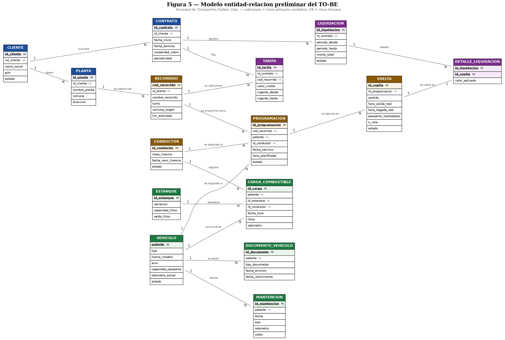

# 03 — Modelo de datos preliminar



*Figura 5 — Entidad-relación del TO-BE. Subrayado = clave primaria candidata; FK = clave foránea.*

El fuente Graphviz está en `../assets/05-er-preliminar.dot` y se regenera con:

```bash
dot -Tpng -Gdpi=150 assets/05-er-preliminar.dot -o assets/05-er-preliminar.png
```

## Claves primarias candidatas

| Entidad | PK candidata | Justificación |
|---|---|---|
| CLIENTE | `id_cliente` | El RUT es identificador natural y queda como clave única, pero se usa sustituta por estabilidad referencial |
| PLANTA | `id_planta` | Un cliente opera más de una planta de destino |
| CONTRATO | `id_contrato` | Un cliente puede tener contratos sucesivos con distintas vigencias |
| RECORRIDO | `cod_recorrido` | Se adopta la codificación de 48 recorridos que la empresa ya usa |
| TARIFA | `id_tarifa` | La combinación contrato–recorrido se repite con distintos valores en el tiempo |
| CONDUCTOR | `id_conductor` | Clave sustituta deliberada: evita almacenar el RUT |
| VEHICULO | `patente` | Identificador único, estable y ya usado en todas las planillas |
| DOCUMENTO_VEHICULO | `id_documento` | Un vehículo acumula documentos de distinto tipo y vigencia |
| MANTENCION | `id_mantencion` | Evento repetible sobre el mismo vehículo |
| ESTANQUE | `id_estanque` | La empresa opera tres estanques propios |
| CARGA_COMBUSTIBLE | `id_carga` | Evento con marca de tiempo, repetible |
| PROGRAMACION | `id_programacion` | Alternativa natural: (`fecha_servicio`, `cod_recorrido`, `patente`) |
| VUELTA | `id_vuelta` | Unidad mínima de servicio y de cobro |
| LIQUIDACION | `id_liquidacion` | Documento de cobro por contrato y periodo |
| DETALLE_LIQUIDACION | (`id_liquidacion`, `id_vuelta`) | Compuesta: impide que una vuelta se cobre dos veces |

## Cardinalidades

| Relación | Card. | Lectura |
|---|---|---|
| CLIENTE – CONTRATO | 1:N | Un cliente suscribe uno o más contratos |
| CLIENTE – PLANTA | 1:N | Un cliente opera una o más plantas |
| PLANTA – RECORRIDO | 1:N | Una planta es destino de varios recorridos |
| CONTRATO – TARIFA | 1:N | Un contrato fija el valor de varios recorridos |
| RECORRIDO – TARIFA | 1:N | Un recorrido se valoriza distinto según contrato y vigencia |
| RECORRIDO – PROGRAMACION | 1:N | Un recorrido se programa muchas veces |
| VEHICULO – PROGRAMACION | 1:N | Un vehículo se asigna a muchas programaciones |
| CONDUCTOR – PROGRAMACION | 1:N | Un conductor se asigna a muchas programaciones |
| PROGRAMACION – VUELTA | 1:N | Una programación se ejecuta en varias vueltas |
| VEHICULO – DOCUMENTO_VEHICULO | 1:N | Un vehículo acredita RT, permiso y seguro |
| VEHICULO – MANTENCION | 1:N | Un vehículo recibe múltiples mantenciones |
| VEHICULO – CARGA_COMBUSTIBLE | 1:N | Un vehículo registra múltiples cargas |
| ESTANQUE – CARGA_COMBUSTIBLE | 1:N | Un estanque abastece múltiples cargas |
| CONDUCTOR – CARGA_COMBUSTIBLE | 1:N | Un conductor registra múltiples cargas |
| CONTRATO – LIQUIDACION | 1:N | Un contrato genera una liquidación por periodo |
| LIQUIDACION – DETALLE_LIQUIDACION | 1:N | Una liquidación detalla muchas vueltas |
| VUELTA – DETALLE_LIQUIDACION | 1:1 | Una vuelta se cobra exactamente una vez |

## Trazabilidad proceso ↔ datos

| Actividad del TO-BE | Entidades | Requisito |
|---|---|---|
| Registrar requerimiento y seleccionar recorrido | RECORRIDO, PLANTA, CONTRATO | RF-01 |
| Validar disponibilidad, RT y licencia | VEHICULO, DOCUMENTO_VEHICULO, CONDUCTOR | RF-03, RF-08 |
| Confirmar asignación | PROGRAMACION | RF-02 |
| Generar hoja de ruta precargada | PROGRAMACION, RECORRIDO, VEHICULO, CONDUCTOR | RF-13 |
| Registrar ejecución de la jornada | VUELTA | RF-04 |
| Registrar carga de combustible | CARGA_COMBUSTIBLE, ESTANQUE, VEHICULO | RF-06 |
| Calcular rendimiento y alertar | CARGA_COMBUSTIBLE, VEHICULO | RF-07 |
| Consolidar vueltas por contrato | VUELTA, PROGRAMACION, RECORRIDO, TARIFA, CONTRATO | RF-10 |
| Generar preliquidación | LIQUIDACION, DETALLE_LIQUIDACION, TARIFA | RF-15 |
| Recuperar trazabilidad ante reclamo | VUELTA → PROGRAMACION → CONDUCTOR, VEHICULO, RECORRIDO | RF-11 |
| Evaluar kilometraje y vencimientos | VEHICULO, MANTENCION, DOCUMENTO_VEHICULO | RF-08, RF-14 |

## Decisiones de diseño

**Separación entre PROGRAMACION y VUELTA.** Es la decisión más importante del modelo. La
programación es lo planificado y la vuelta es lo ejecutado. Separarlas permite medir
cumplimiento, detectar vueltas programadas que no se hicieron y cobrar solo por lo realizado.
En el AS-IS ambos conceptos van en la misma fila del Excel de Tráfico, y por eso hoy no se
puede distinguir una vuelta no ejecutada de una que se hizo pero no se registró.

**Historial de tarifas con vigencias.** La empresa sí ha reajustado tarifas. Si el valor
fuera un atributo del recorrido no se podría recalcular un periodo anterior, así que TARIFA
lleva `vigente_desde` y `vigente_hasta`.

**No se guardan datos personales, y es a propósito.** CONDUCTOR no guarda nombre, RUT ni
domicilio, solo identificador, clase de licencia, vencimiento y estado. VUELTA guarda cuántos
pasajeros se trasladaron, nunca quiénes. Anticipa la Ley 21.719 (RNF-04 y exclusión RF-20).

**El odómetro aparece en dos lugares.** `VEHICULO.odometro_actual` guarda el último valor
para controlar umbrales de mantención; `CARGA_COMBUSTIBLE.odometro` y `MANTENCION.odometro`
guardan la lectura histórica de cada evento. La redundancia es intencional: sin ella,
calcular el rendimiento entre dos cargas seguidas obligaría a recorrer toda la historia del
vehículo.
